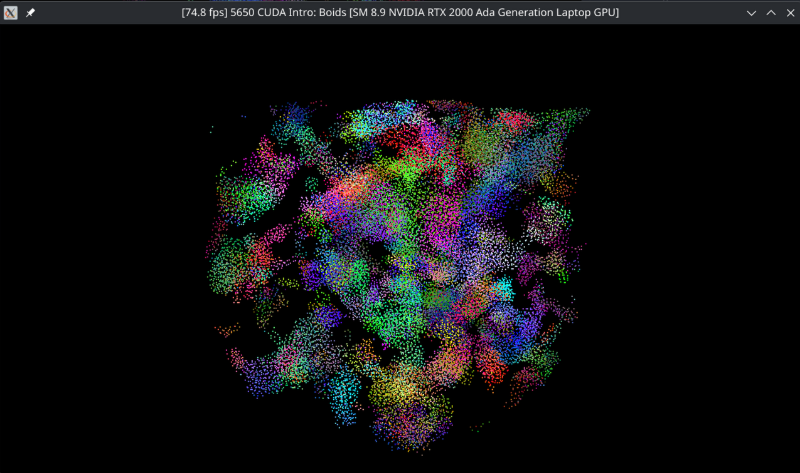

**University of Pennsylvania, CIS 5650: GPU Programming and Architecture,
Project 1 - Flocking**

* Andrea Gonzalez Varela
  * [Linkedin](https://www.linkedin.com/in/andreagvarela/)
* Tested on: Linux, 13th Gen Intel(R) Core(TM) i9-13980HX @ 5.6GHz 128GB, RTX 2000 Ada Generation 8GB (Personal)

### Performance analysis

#### Framerate change with increasing # of boids for naive, scattered uniform grid, and coherent uniform grid (with and without visualization)

#### Framerate change with increasing block size

### Questions

#### For each implementation, how does changing the number of boids affect performance? Why do you think this is?

#### For each implementation, how does changing the block count and block size affect performance? Why do you think this is?

#### For the coherent uniform grid: did you experience any performance improvements with the more coherent uniform grid? Was this the outcome you expected? Why or why not?

#### Did changing cell width and checking 27 vs 8 neighboring cells affect performance?Why or why not? Be careful: it is insufficient (and possibly incorrect) to say that 27-cell is slower simply because there are more cells to check!
