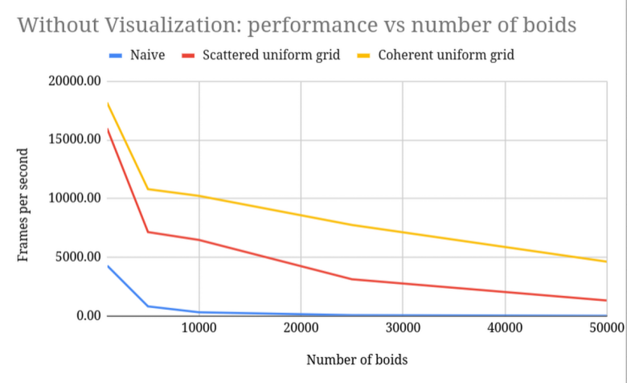
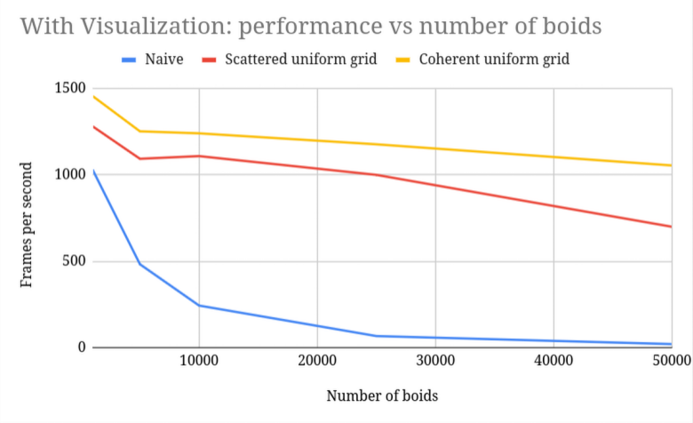
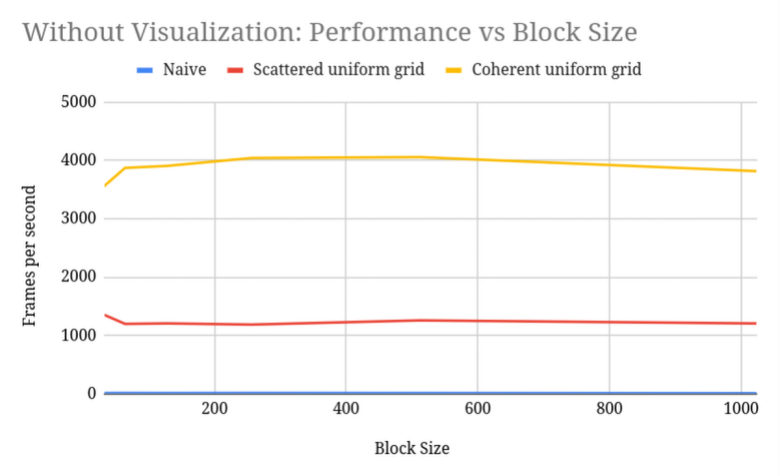

**University of Pennsylvania, CIS 5650: GPU Programming and Architecture,
Project 1 - Flocking**

* Andrea Gonzalez Varela
  * [Linkedin](https://www.linkedin.com/in/andreagvarela/)
* Tested on: Linux, 13th Gen Intel(R) Core(TM) i9-13980HX @ 5.6GHz 128GB, RTX 2000 Ada Generation 8GB (Personal)

### Overview

This project implements boids flocking in CUDA. The first implementation is naive by searching all pairs, and the subsequent iteration improve performance by using a uniform-grid to partition the space into cells and reduce unnecesssary comparisons between boids. The final optimization (coherent grid) reorders the boid data to improve locality.

### Performance analysis

#### Framerate change with increasing # of boids for naive, scattered uniform grid, and coherent uniform grid (with and without visualization)

#### Framerate change with increasing block size

### Questions

#### For each implementation, how does changing the number of boids affect performance? Why do you think this is?

Increasing the number of boids appears to produce a decay in performance. The reduction in performance makes sense because the number of boids to be computed and the comparisons to measure the updated velocity for each increase. For the uniform-grid implementation, we are comparing less boids than in the niave implementation, but the decay can be explained by the fact that we are still increasing on average the number of boids compared and increase in the number of boids that have to be assigned cells and sorted in case of the coherent implementation.

#### For each implementation, how does changing the block count and block size affect performance? Why do you think this is?

Increasing the block size decreased the block count, and as shown by the graph above, the performance for block sizes between 32 to 1024 remained fairly constant within each implementation. This might be because the bottleneck in the algorithm might lie more in the actual step by step of the velopcity update step (that is what it seemed like when I ran debugging profiling too).

#### For the coherent uniform grid: did you experience any performance improvements with the more coherent uniform grid? Was this the outcome you expected? Why or why not?

I did encounter performance improvements for all number of boids and block sizes. I expected the general improvement because the preprocessing step of rearranging the boid data resulted in the cell, position, and velocity data for the boid to be closer together, improving cache locality.

#### Did changing cell width and checking 27 vs 8 neighboring cells affect performance? Why or why not? Be careful: it is insufficient (and possibly incorrect) to say that 27-cell is slower simply because there are more cells to check!

Halving the cell width to check the 27 cells actually improved performancecompared to the 8 neighbor cells when I tested (1916 vs 1303 fps for the scattered grid without visualization). This was surprising to me, but I think it might have to do with the smaller volume that needs to be checked (so less boids checked per velocity update step).
